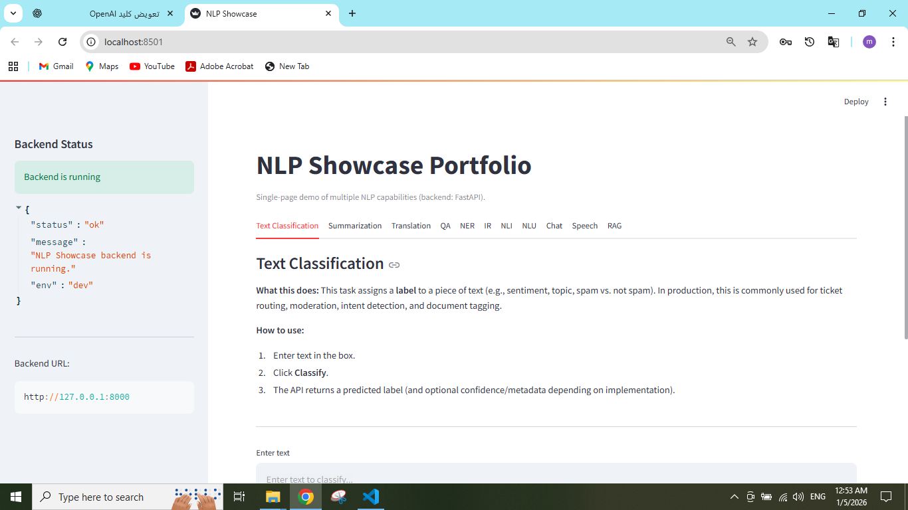
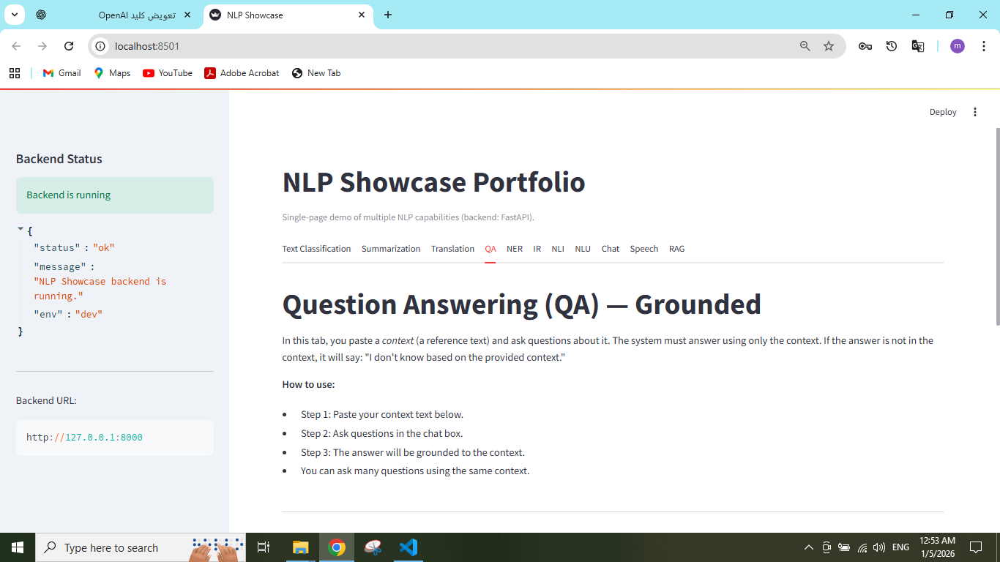
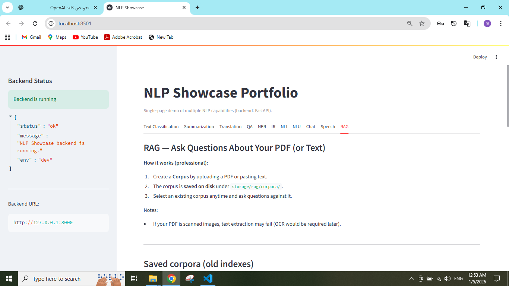

## Screenshots

### User Interface


### QA Example


### RAG Example


### API Documentation


# NLP Showcase Portfolio

This project is a full-stack NLP showcase designed as a professional portfolio.
It demonstrates multiple Natural Language Processing tasks using a FastAPI backend
and a Streamlit frontend.

The main goal of this project is to show clean architecture, modular design,
and production-minded integration of Large Language Models (LLMs) using OpenAI APIs.

## NLP Capabilities

This project includes implementations and demos for the following NLP tasks:

- Chat with LLM
- Retrieval-Augmented Generation (RAG)
- Information Retrieval (IR)
- Question Answering (QA)
- Named Entity Recognition (NER)
- Text Classification
- Text Summarization
- Machine Translation
- Natural Language Inference (NLI)
- Natural Language Understanding (NLU)
- Speech (Text-to-Speech and Speech-to-Text)

## Architecture

- **Backend:** FastAPI  
  - API routers are separated by NLP task.
  - Business logic is implemented in service modules.
  - Shared OpenAI client with timeout, retry, and error handling.

- **Frontend:** Streamlit  
  - Simple multi-tab UI for demonstrating each NLP capability.
  - Communicates with backend through HTTP APIs.

## Setup & Run

### 1. Create virtual environment
```bash
python -m venv .venv
source .venv/bin/activate  # Windows: .\.venv\Scripts\activate
pip install -r requirements.txt

### 2. Configure environment variables

Create a `.env` file in the project root using `.env.example` as a template.

```env
OPENAI_API_KEY=your_openai_api_key

uvicorn backend.main:app --reload
streamlit run frontend/app.py
